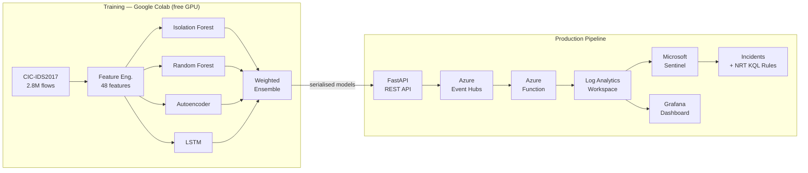

# CyberSentinel-AI


> End-to-end AI/ML network intrusion detection system — trained on 2.8M real
> network flows, deployed as a REST API, and integrated with Microsoft Sentinel
> for real-time threat detection and automated incident creation.

---

## Architecture



---

## Models

| Model | Type | Trains on | Strength |
|---|---|---|---|
| Isolation Forest | Unsupervised anomaly | Benign only | Detects zero-day patterns |
| Random Forest | Supervised classifier | Full dataset | Identifies named attack types |
| Autoencoder | Deep learning anomaly | Benign only | Detects subtle behavioural deviations |
| LSTM | Sequential deep learning | SMOTE balanced | Detects multi-step attack chains |

---

## Test set results

48 engineered features, evaluated on a held-out stratified test split (15% of 2.83M flows).

| Model | Precision | Recall | F1 | ROC-AUC | FPR |
|---|---|---|---|---|---|
| Isolation Forest | 0.4912 | 0.5662 | 0.5261 | 0.858 | 9.97% |
| Random Forest | 0.9961 | 0.9969 | 0.9965 | 1.000 | 0.07% |
| Autoencoder | 0.7137 | 0.7237 | 0.7187 | 0.912 | 4.94% |
| LSTM | 0.2682 | 0.3236 | 0.2933 | 0.691 | 14.97% |

**Ensemble** — weighted vote, validated on the held-out validation split:

| Weight: Isolation Forest | Weight: Random Forest | Weight: Autoencoder | Weight: LSTM | Decision threshold | Validation ROC-AUC |
|---|---|---|---|---|---|
| 0.207 | 0.394 | 0.283 | 0.115 | 0.319 | 0.9997 |

Weights are computed automatically, proportional to each model's validation F1 score.

### Notes on model performance

Random Forest is the strongest individual model by a wide margin, which is expected
— it is the only supervised classifier trained directly on labelled attack signatures,
and CIC-IDS2017's attack patterns are well-represented in its training data.

LSTM is the weakest performer here. The sequences it trains on are built from sliding
windows over SMOTE-balanced, shuffled flow data rather than genuine per-session
time-ordered traffic (grouping by source IP and time window). In a production
deployment with proper session-keyed sequencing, LSTM's recall on multi-step attack
chains would likely improve substantially. It is retained in the ensemble — at the
lowest weight — specifically for its unique ability to model temporal patterns that
the other three architectures cannot.

Isolation Forest and Autoencoder, both trained exclusively on benign traffic, perform
as expected for unsupervised anomaly detectors: solid recall with a higher false
positive rate than the supervised model, since they flag anything statistically
unusual rather than matching known attack signatures. This is precisely their value
in the ensemble — they are the components most likely to catch a genuinely novel,
zero-day attack pattern that Random Forest has never seen labelled examples of.

---

## Dataset

**CIC-IDS2017** — Canadian Institute for Cybersecurity
- 2,830,540 labelled network flows
- 80 raw features → 48 selected after variance and correlation filtering
- 14 attack categories across 5 days of captured traffic
- Class imbalance: ~80% benign, ~20% attack — handled with SMOTE for the LSTM
  training set; Random Forest handles imbalance directly via `class_weight=balanced`

---

## API endpoints

| Endpoint | Method | Description |
|---|---|---|
| `/health` | GET | Server and model health check |
| `/models/info` | GET | Feature list and model descriptions |
| `/predict` | POST | Score a single network flow |
| `/predict/batch` | POST | Score up to 1,000 flows at once |

Interactive documentation: `http://localhost:8000/docs`

---

## Azure SIEM integration

HIGH and CRITICAL detections stream automatically to Microsoft Sentinel via
Azure Event Hubs and an Azure Function, landing in a custom Log Analytics table
(`CyberSentinelDetections_CL`). Three NRT (near-real-time) detection rules create
incidents automatically:

- **High confidence attack** — ensemble score ≥ 0.50, multiple models agree
- **Attack burst** — more than 2 attacks within a 5-minute window
- **Anomaly consensus** — both unsupervised models (Isolation Forest + Autoencoder)
  flag the same traffic independently — a strong zero-day indicator

MITRE ATT&CK coverage: T1499, T1498, T1046, T1110, T1190, T1071, T1078
(see `sentinel/mitre_navigator_layer.json` for the full annotated map)

A direct Log Analytics HTTP Data Collector sender (`src/api/log_analytics_sender.py`)
is also included as a fallback path, used during development when Event Hubs
connectivity was constrained by local network restrictions.

---

## Tech stack

| Layer | Technology |
|---|---|
| Language | Python 3.10 |
| ML training | Scikit-learn, PyTorch, Google Colab (free GPU) |
| Explainability | SHAP (TreeExplainer) |
| API server | FastAPI + Uvicorn |
| Containerisation | Docker + docker-compose |
| Stream ingestion | Azure Event Hubs |
| Serverless processing | Azure Functions (Python v2, Event Hub trigger) |
| SIEM | Microsoft Sentinel + Log Analytics (NRT analytics rules) |
| Dashboard | Grafana (Azure Monitor data source) |
| Dataset | CIC-IDS2017 (Canadian Institute for Cybersecurity) |

---

## Project structure

```
cybersentinel-ai/
├── data/                    # Dataset (not tracked — see download link below)
├── notebooks/               # EDA, data engineering, model training notebooks
├── src/
│   ├── data/                # DataLoader and Preprocessor classes
│   ├── models/              # PyTorch model architectures + ensemble
│   └── api/                 # FastAPI server, schemas, predictor, senders
├── models/saved/            # Trained model artifacts (not tracked)
├── azure-function/          # Azure Functions code (Event Hub trigger)
├── sentinel/                # KQL detection rules + MITRE ATT&CK mapping
├── configs/                 # YAML configuration
├── tests/                   # API test suite
└── docs/                    # Architecture diagrams and screenshots
```

---

## Quick start

```bash
# Clone and set up environment
git clone https://github.com/zzainamir/cybersentinel-ai.git
cd cybersentinel-ai
conda create -n cybersentinel python=3.10 -y
conda activate cybersentinel
pip install -r requirements.txt

# Download CIC-IDS2017 dataset
# https://www.unb.ca/cic/datasets/ids-2017.html
# Place CSV files in data/raw/

# Run Phase 2 preprocessing and Phase 3 training — see notebooks/
# Then start the API:
uvicorn src.api.main:app --host 0.0.0.0 --port 8000

# Or run with Docker:
docker-compose up
```

---

## Dataset download

The CIC-IDS2017 dataset is available free from the Canadian Institute for
Cybersecurity: https://www.unb.ca/cic/datasets/ids-2017.html

Download the CSV files only (not PCAP). Place them in `data/raw/`.

---

## Phases

- [x] Phase 1: Foundation and dataset EDA
- [x] Phase 2: Data engineering and feature pipeline
- [x] Phase 3: ML model training and SHAP explainability
- [x] Phase 4: FastAPI inference server and Docker
- [x] Phase 5: Azure Sentinel integration and KQL rules
- [x] Phase 6: Grafana dashboard and portfolio documentation

---

## License

MIT — see [LICENSE](LICENSE)